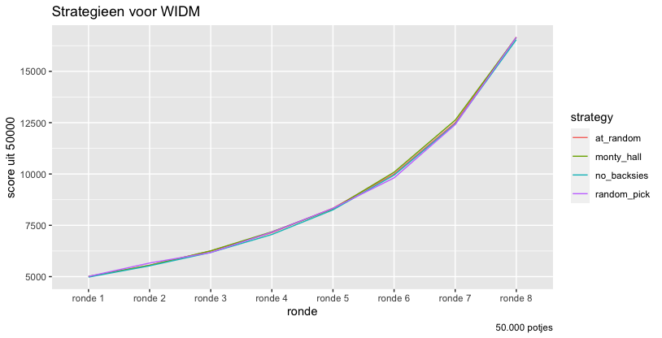
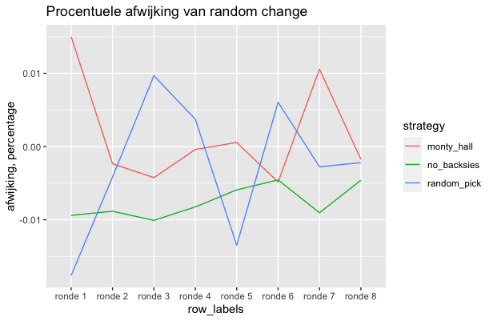

# Wie is de mol simulatie

Aangezien je op tv nooit echt kunt zien wie de mol is, is het eigenlijk een monty hall situatie (volgens Jasper).

Laten we drie strategieën vergelijken:

- Monty hall: Iedere keer dat een speler afvalt (Gaat er een deur open) switch je naar een andere speler als mol.
- No Backsies: Kies 1 speler als mol en blijf daarop, tenzij je keuze afvalt, kies dan een willekeurige andere en blijf daarbij.
- Kies elke ronde een willekeurige speler uit (dat kan dus ook dezelfde zijn)

En laten we het vergelijken met puur willekeurige kans oftwel: 1 op 9, 1 op 8, 1 op 7 etc. 

We simuleren 50.000 potjes waarbij
- we 1 van de 10 spelers als mol maken
- er 8 spelers in willekeurige volgorde afvallen
- als jouw strategie de mol heeft gekozen in een ronde krijg je een punt

Het lijkt niet uit te maken wat je kiest, want elke strategie is ongeveer even goed als willekeurige kans.
Kijk eens naar een resultaat

in 50.000 potjes is 
- willekeurige kans: 16666.67  (50.000/3)
- no backsies: 16542
- monty_hall: 16649

De verschillen die we hier zien zijn volgens mij random noise. 

Dus, als WIDM inderdaad geen relevante informatie bevat dan maakt het niet uit of je switched. Over 50.000 potjes is het allemaal hetzelfde.
